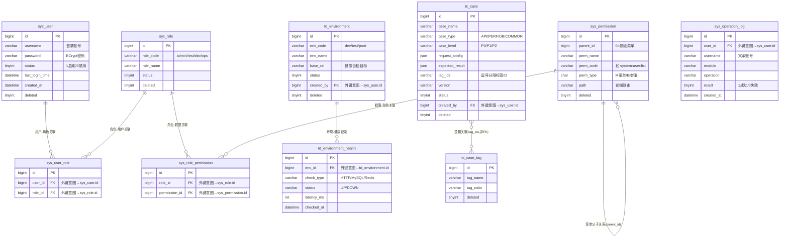

# 数据模型设计（M1 基础平台）

| 项目 | 内容 |
|:-----|:-----|
| 文档版本 | v1.0 |
| 编写日期 | 2026-09-21 |
| 文档状态 | 已评审（阶段 1 设计交付物） |
| 适用范围 | M1 基础平台（REQ-001 ~ REQ-008） |
| 关联文档 | `DESIGN_系统架构.md` / `DESIGN_接口设计.md` / `ADR/ADR-001-技术栈选型.md` |

---

## 1. 设计约定

### 1.1 DDL 规范（全部表统一遵守）

| 项 | 约定 |
|:---|:-----|
| 引擎/字符集 | `ENGINE=InnoDB DEFAULT CHARSET=utf8mb4 COLLATE=utf8mb4_unicode_ci` |
| 主键 | `bigint NOT NULL AUTO_INCREMENT`，命名 `id` |
| 时间字段 | `created_at` / `updated_at` 均为 `datetime`，默认 `CURRENT_TIMESTAMP`，`updated_at` 带 `ON UPDATE CURRENT_TIMESTAMP` |
| 逻辑删除 | `deleted tinyint NOT NULL DEFAULT 0`（0=正常 / 1=已删除），MyBatis-Plus 全局逻辑删除插件自动过滤 |
| 唯一索引 | 前缀 `uk_`；**逻辑删除表唯一索引必须包含 `deleted` 字段**（如 `uk_username(username, deleted)`），保证删除后可重建同名记录 |
| 普通索引 | 前缀 `idx_` |
| 外键 | **不建真实 FK 约束**（MyBatis-Plus 风格，关联由应用层维护），外键意图以字段注释 `（外键意图 → 表.字段）` 标注 |
| 审计表 | `sys_operation_log` / `td_environment_health` 只增不改，**无 `updated_at` / `deleted`**（PRD 3.2：审计日志不可被普通用户删除） |
| 表前缀 | `sys_`（系统权限类）/ `td_`（测试环境类）/ `tc_`（测试用例类） |

### 1.2 逻辑删除约定

- 所有查询默认 `WHERE deleted = 0`（MyBatis-Plus 插件自动追加）。
- 删除操作 = `UPDATE ... SET deleted = 1`，物理删除仅限关联表（`sys_user_role` / `sys_role_permission`，随主记录级联清理）。

### 1.3 用例-标签关联约定

`tc_case` 与 `tc_case_tag` 为**多对多逻辑关联**：`tc_case.tag_ids` 存逗号分隔的标签 ID 字符串（如 `"1,2,3"`），由应用层维护，不建关联表（M1 规模下避免过度设计；M2+ 若标签需独立统计再拆关联表）。

---

## 2. ER 图



---

## 3. 表设计（字段表 + DDL + 索引）

### 3.1 `sys_user` — 用户表

| 字段 | 类型 | 允许空 | 默认 | 说明 |
|:-----|:-----|:------:|:-----|:-----|
| id | bigint | 否 | 自增 | 主键 |
| username | varchar(50) | 否 | - | 登录账号 |
| password | varchar(100) | 否 | - | BCrypt 加密密码 |
| nickname | varchar(50) | 否 | - | 昵称/姓名 |
| email | varchar(100) | 是 | NULL | 邮箱 |
| phone | varchar(20) | 是 | NULL | 手机号 |
| avatar | varchar(255) | 是 | NULL | 头像 URL |
| status | tinyint | 否 | 1 | 状态：1启用 / 0禁用 |
| last_login_time | datetime | 是 | NULL | 最后登录时间 |
| last_login_ip | varchar(50) | 是 | NULL | 最后登录 IP |
| created_at | datetime | 否 | CURRENT_TIMESTAMP | 创建时间 |
| updated_at | datetime | 否 | CURRENT_TIMESTAMP | 更新时间（自动更新） |
| deleted | tinyint | 否 | 0 | 逻辑删除：0正常 / 1删除 |

```sql
CREATE TABLE `sys_user` (
  `id` bigint NOT NULL AUTO_INCREMENT COMMENT '主键',
  `username` varchar(50) NOT NULL COMMENT '登录账号',
  `password` varchar(100) NOT NULL COMMENT 'BCrypt 加密密码',
  `nickname` varchar(50) NOT NULL COMMENT '昵称/姓名',
  `email` varchar(100) DEFAULT NULL COMMENT '邮箱',
  `phone` varchar(20) DEFAULT NULL COMMENT '手机号',
  `avatar` varchar(255) DEFAULT NULL COMMENT '头像 URL',
  `status` tinyint NOT NULL DEFAULT 1 COMMENT '状态：1启用 / 0禁用',
  `last_login_time` datetime DEFAULT NULL COMMENT '最后登录时间',
  `last_login_ip` varchar(50) DEFAULT NULL COMMENT '最后登录 IP',
  `created_at` datetime NOT NULL DEFAULT CURRENT_TIMESTAMP COMMENT '创建时间',
  `updated_at` datetime NOT NULL DEFAULT CURRENT_TIMESTAMP ON UPDATE CURRENT_TIMESTAMP COMMENT '更新时间',
  `deleted` tinyint NOT NULL DEFAULT 0 COMMENT '逻辑删除：0正常 / 1删除',
  PRIMARY KEY (`id`),
  UNIQUE KEY `uk_username` (`username`, `deleted`)
) ENGINE=InnoDB DEFAULT CHARSET=utf8mb4 COLLATE=utf8mb4_unicode_ci COMMENT='用户表';
```

索引说明：`uk_username(username, deleted)` 唯一索引——登录按 username 精确查询；含 deleted 保证逻辑删除后可重建同名账号。

### 3.2 `sys_role` — 角色表

| 字段 | 类型 | 允许空 | 默认 | 说明 |
|:-----|:-----|:------:|:-----|:-----|
| id | bigint | 否 | 自增 | 主键 |
| role_code | varchar(50) | 否 | - | 角色编码（admin / test / dev / ops） |
| role_name | varchar(50) | 否 | - | 角色名称 |
| description | varchar(255) | 是 | NULL | 角色描述 |
| status | tinyint | 否 | 1 | 状态：1启用 / 0禁用 |
| created_at | datetime | 否 | CURRENT_TIMESTAMP | 创建时间 |
| updated_at | datetime | 否 | CURRENT_TIMESTAMP | 更新时间（自动更新） |
| deleted | tinyint | 否 | 0 | 逻辑删除：0正常 / 1删除 |

```sql
CREATE TABLE `sys_role` (
  `id` bigint NOT NULL AUTO_INCREMENT COMMENT '主键',
  `role_code` varchar(50) NOT NULL COMMENT '角色编码（admin/test/dev/ops）',
  `role_name` varchar(50) NOT NULL COMMENT '角色名称',
  `description` varchar(255) DEFAULT NULL COMMENT '角色描述',
  `status` tinyint NOT NULL DEFAULT 1 COMMENT '状态：1启用 / 0禁用',
  `created_at` datetime NOT NULL DEFAULT CURRENT_TIMESTAMP COMMENT '创建时间',
  `updated_at` datetime NOT NULL DEFAULT CURRENT_TIMESTAMP ON UPDATE CURRENT_TIMESTAMP COMMENT '更新时间',
  `deleted` tinyint NOT NULL DEFAULT 0 COMMENT '逻辑删除：0正常 / 1删除',
  PRIMARY KEY (`id`),
  UNIQUE KEY `uk_role_code` (`role_code`, `deleted`)
) ENGINE=InnoDB DEFAULT CHARSET=utf8mb4 COLLATE=utf8mb4_unicode_ci COMMENT='角色表';
```

索引说明：`uk_role_code(role_code, deleted)` 唯一索引——角色编码全局唯一。

### 3.3 `sys_user_role` — 用户-角色关联表

| 字段 | 类型 | 允许空 | 默认 | 说明 |
|:-----|:-----|:------:|:-----|:-----|
| id | bigint | 否 | 自增 | 主键 |
| user_id | bigint | 否 | - | 用户 ID（外键意图 → sys_user.id） |
| role_id | bigint | 否 | - | 角色 ID（外键意图 → sys_role.id） |
| created_at | datetime | 否 | CURRENT_TIMESTAMP | 创建时间 |

```sql
CREATE TABLE `sys_user_role` (
  `id` bigint NOT NULL AUTO_INCREMENT COMMENT '主键',
  `user_id` bigint NOT NULL COMMENT '用户 ID（外键意图 → sys_user.id）',
  `role_id` bigint NOT NULL COMMENT '角色 ID（外键意图 → sys_role.id）',
  `created_at` datetime NOT NULL DEFAULT CURRENT_TIMESTAMP COMMENT '创建时间',
  PRIMARY KEY (`id`),
  UNIQUE KEY `uk_user_role` (`user_id`, `role_id`),
  KEY `idx_role_id` (`role_id`)
) ENGINE=InnoDB DEFAULT CHARSET=utf8mb4 COLLATE=utf8mb4_unicode_ci COMMENT='用户-角色关联表';
```

索引说明：`uk_user_role(user_id, role_id)` 防重复绑定；`idx_role_id` 支持按角色反查用户。关联表无逻辑删除，用户/角色删除时级联清理本表记录。

### 3.4 `sys_permission` — 权限表（菜单 + 按钮）

| 字段 | 类型 | 允许空 | 默认 | 说明 |
|:-----|:-----|:------:|:-----|:-----|
| id | bigint | 否 | 自增 | 主键 |
| parent_id | bigint | 否 | 0 | 父级 ID（0=顶级菜单；外键意图 → sys_permission.id） |
| perm_name | varchar(50) | 否 | - | 权限/菜单名称 |
| perm_code | varchar(100) | 否 | - | 权限码（如 `system:user:list`） |
| perm_type | char(1) | 否 | M | 类型：M菜单 / B按钮 |
| path | varchar(200) | 是 | NULL | 前端路由路径（菜单用） |
| icon | varchar(50) | 是 | NULL | 菜单图标 |
| sort | int | 否 | 0 | 排序号（同级升序） |
| status | tinyint | 否 | 1 | 状态：1启用 / 0禁用 |
| created_at | datetime | 否 | CURRENT_TIMESTAMP | 创建时间 |
| updated_at | datetime | 否 | CURRENT_TIMESTAMP | 更新时间（自动更新） |
| deleted | tinyint | 否 | 0 | 逻辑删除：0正常 / 1删除 |

```sql
CREATE TABLE `sys_permission` (
  `id` bigint NOT NULL AUTO_INCREMENT COMMENT '主键',
  `parent_id` bigint NOT NULL DEFAULT 0 COMMENT '父级 ID（0=顶级菜单；外键意图 → sys_permission.id）',
  `perm_name` varchar(50) NOT NULL COMMENT '权限/菜单名称',
  `perm_code` varchar(100) NOT NULL COMMENT '权限码（如 system:user:list）',
  `perm_type` char(1) NOT NULL DEFAULT 'M' COMMENT '类型：M菜单 / B按钮',
  `path` varchar(200) DEFAULT NULL COMMENT '前端路由路径（菜单用）',
  `icon` varchar(50) DEFAULT NULL COMMENT '菜单图标',
  `sort` int NOT NULL DEFAULT 0 COMMENT '排序号（同级升序）',
  `status` tinyint NOT NULL DEFAULT 1 COMMENT '状态：1启用 / 0禁用',
  `created_at` datetime NOT NULL DEFAULT CURRENT_TIMESTAMP COMMENT '创建时间',
  `updated_at` datetime NOT NULL DEFAULT CURRENT_TIMESTAMP ON UPDATE CURRENT_TIMESTAMP COMMENT '更新时间',
  `deleted` tinyint NOT NULL DEFAULT 0 COMMENT '逻辑删除：0正常 / 1删除',
  PRIMARY KEY (`id`),
  UNIQUE KEY `uk_perm_code` (`perm_code`, `deleted`),
  KEY `idx_parent_id` (`parent_id`)
) ENGINE=InnoDB DEFAULT CHARSET=utf8mb4 COLLATE=utf8mb4_unicode_ci COMMENT='权限表（菜单+按钮）';
```

索引说明：`uk_perm_code(perm_code, deleted)` 权限码全局唯一；`idx_parent_id` 支撑权限树递归查询。

### 3.5 `sys_role_permission` — 角色-权限关联表

| 字段 | 类型 | 允许空 | 默认 | 说明 |
|:-----|:-----|:------:|:-----|:-----|
| id | bigint | 否 | 自增 | 主键 |
| role_id | bigint | 否 | - | 角色 ID（外键意图 → sys_role.id） |
| permission_id | bigint | 否 | - | 权限 ID（外键意图 → sys_permission.id） |
| created_at | datetime | 否 | CURRENT_TIMESTAMP | 创建时间 |

```sql
CREATE TABLE `sys_role_permission` (
  `id` bigint NOT NULL AUTO_INCREMENT COMMENT '主键',
  `role_id` bigint NOT NULL COMMENT '角色 ID（外键意图 → sys_role.id）',
  `permission_id` bigint NOT NULL COMMENT '权限 ID（外键意图 → sys_permission.id）',
  `created_at` datetime NOT NULL DEFAULT CURRENT_TIMESTAMP COMMENT '创建时间',
  PRIMARY KEY (`id`),
  UNIQUE KEY `uk_role_perm` (`role_id`, `permission_id`),
  KEY `idx_permission_id` (`permission_id`)
) ENGINE=InnoDB DEFAULT CHARSET=utf8mb4 COLLATE=utf8mb4_unicode_ci COMMENT='角色-权限关联表';
```

索引说明：`uk_role_perm(role_id, permission_id)` 防重复授权；`idx_permission_id` 支持按权限反查角色。角色删除时级联清理本表记录。

### 3.6 `sys_operation_log` — 操作审计日志表（只增不改）

| 字段 | 类型 | 允许空 | 默认 | 说明 |
|:-----|:-----|:------:|:-----|:-----|
| id | bigint | 否 | 自增 | 主键 |
| user_id | bigint | 否 | - | 操作人 ID（外键意图 → sys_user.id） |
| username | varchar(50) | 否 | - | 操作人账号（冗余，防用户删除后丢失） |
| module | varchar(50) | 否 | - | 所属模块（auth/system/env/case/dashboard/search） |
| operation | varchar(100) | 否 | - | 操作描述（如"新增用户"） |
| method | varchar(10) | 否 | - | HTTP 方法（GET/POST/PUT/DELETE） |
| url | varchar(255) | 否 | - | 请求路径 |
| params | text | 是 | NULL | 请求参数（JSON 字符串，敏感字段脱敏） |
| result | tinyint | 否 | 1 | 结果：1成功 / 0失败 |
| error_msg | varchar(500) | 是 | NULL | 失败原因 |
| ip | varchar(50) | 是 | NULL | 操作 IP |
| cost_ms | int | 否 | 0 | 耗时（毫秒） |
| created_at | datetime | 否 | CURRENT_TIMESTAMP | 操作时间 |

```sql
CREATE TABLE `sys_operation_log` (
  `id` bigint NOT NULL AUTO_INCREMENT COMMENT '主键',
  `user_id` bigint NOT NULL COMMENT '操作人 ID（外键意图 → sys_user.id）',
  `username` varchar(50) NOT NULL COMMENT '操作人账号（冗余，防用户删除后丢失）',
  `module` varchar(50) NOT NULL COMMENT '所属模块（auth/system/env/case/dashboard/search）',
  `operation` varchar(100) NOT NULL COMMENT '操作描述（如"新增用户"）',
  `method` varchar(10) NOT NULL COMMENT 'HTTP 方法（GET/POST/PUT/DELETE）',
  `url` varchar(255) NOT NULL COMMENT '请求路径',
  `params` text COMMENT '请求参数（JSON 字符串，敏感字段脱敏）',
  `result` tinyint NOT NULL DEFAULT 1 COMMENT '结果：1成功 / 0失败',
  `error_msg` varchar(500) DEFAULT NULL COMMENT '失败原因',
  `ip` varchar(50) DEFAULT NULL COMMENT '操作 IP',
  `cost_ms` int NOT NULL DEFAULT 0 COMMENT '耗时（毫秒）',
  `created_at` datetime NOT NULL DEFAULT CURRENT_TIMESTAMP COMMENT '操作时间',
  PRIMARY KEY (`id`),
  KEY `idx_user_id` (`user_id`),
  KEY `idx_module` (`module`),
  KEY `idx_created_at` (`created_at`)
) ENGINE=InnoDB DEFAULT CHARSET=utf8mb4 COLLATE=utf8mb4_unicode_ci COMMENT='操作审计日志表（只增不改）';
```

索引说明：`idx_user_id` 按人查审计；`idx_module` 按模块查审计；`idx_created_at` 按时间范围查审计。本表无 `updated_at` / `deleted`，应用层禁止删除接口（PRD 3.2 安全需求）。

### 3.7 `td_environment` — 测试环境表

| 字段 | 类型 | 允许空 | 默认 | 说明 |
|:-----|:-----|:------:|:-----|:-----|
| id | bigint | 否 | 自增 | 主键 |
| env_code | varchar(50) | 否 | - | 环境标识（dev / test / prod） |
| env_name | varchar(50) | 否 | - | 环境名称 |
| base_url | varchar(255) | 是 | NULL | 被测系统基础地址（健康自检探测目标） |
| description | varchar(255) | 是 | NULL | 环境描述 |
| sort | int | 否 | 0 | 排序号 |
| status | tinyint | 否 | 1 | 状态：1启用 / 0停用 |
| created_by | bigint | 否 | - | 创建人（外键意图 → sys_user.id） |
| created_at | datetime | 否 | CURRENT_TIMESTAMP | 创建时间 |
| updated_at | datetime | 否 | CURRENT_TIMESTAMP | 更新时间（自动更新） |
| deleted | tinyint | 否 | 0 | 逻辑删除：0正常 / 1删除 |

```sql
CREATE TABLE `td_environment` (
  `id` bigint NOT NULL AUTO_INCREMENT COMMENT '主键',
  `env_code` varchar(50) NOT NULL COMMENT '环境标识（dev/test/prod）',
  `env_name` varchar(50) NOT NULL COMMENT '环境名称',
  `base_url` varchar(255) DEFAULT NULL COMMENT '被测系统基础地址（健康自检探测目标）',
  `description` varchar(255) DEFAULT NULL COMMENT '环境描述',
  `sort` int NOT NULL DEFAULT 0 COMMENT '排序号',
  `status` tinyint NOT NULL DEFAULT 1 COMMENT '状态：1启用 / 0停用',
  `created_by` bigint NOT NULL COMMENT '创建人（外键意图 → sys_user.id）',
  `created_at` datetime NOT NULL DEFAULT CURRENT_TIMESTAMP COMMENT '创建时间',
  `updated_at` datetime NOT NULL DEFAULT CURRENT_TIMESTAMP ON UPDATE CURRENT_TIMESTAMP COMMENT '更新时间',
  `deleted` tinyint NOT NULL DEFAULT 0 COMMENT '逻辑删除：0正常 / 1删除',
  PRIMARY KEY (`id`),
  UNIQUE KEY `uk_env_code` (`env_code`, `deleted`)
) ENGINE=InnoDB DEFAULT CHARSET=utf8mb4 COLLATE=utf8mb4_unicode_ci COMMENT='测试环境表';
```

索引说明：`uk_env_code(env_code, deleted)` 环境标识全局唯一（dev/test/prod 约定俗成）。

### 3.8 `td_environment_health` — 环境健康检查记录表（只增不改）

| 字段 | 类型 | 允许空 | 默认 | 说明 |
|:-----|:-----|:------:|:-----|:-----|
| id | bigint | 否 | 自增 | 主键 |
| env_id | bigint | 否 | - | 环境 ID（外键意图 → td_environment.id） |
| check_type | varchar(20) | 否 | - | 检查类型（HTTP / MySQL / Redis） |
| target | varchar(255) | 否 | - | 检测目标（URL / 连接串，脱敏存储） |
| status | varchar(10) | 否 | - | 结果：UP / DOWN |
| latency_ms | int | 否 | 0 | 响应耗时（毫秒） |
| error_msg | varchar(500) | 是 | NULL | 失败原因 |
| checked_by | bigint | 否 | - | 触发人（外键意图 → sys_user.id；定时任务为 0） |
| checked_at | datetime | 否 | CURRENT_TIMESTAMP | 检查时间 |

```sql
CREATE TABLE `td_environment_health` (
  `id` bigint NOT NULL AUTO_INCREMENT COMMENT '主键',
  `env_id` bigint NOT NULL COMMENT '环境 ID（外键意图 → td_environment.id）',
  `check_type` varchar(20) NOT NULL COMMENT '检查类型（HTTP/MySQL/Redis）',
  `target` varchar(255) NOT NULL COMMENT '检测目标（URL/连接串，脱敏存储）',
  `status` varchar(10) NOT NULL COMMENT '结果：UP / DOWN',
  `latency_ms` int NOT NULL DEFAULT 0 COMMENT '响应耗时（毫秒）',
  `error_msg` varchar(500) DEFAULT NULL COMMENT '失败原因',
  `checked_by` bigint NOT NULL COMMENT '触发人（外键意图 → sys_user.id；定时任务为 0）',
  `checked_at` datetime NOT NULL DEFAULT CURRENT_TIMESTAMP COMMENT '检查时间',
  PRIMARY KEY (`id`),
  KEY `idx_env_id` (`env_id`),
  KEY `idx_checked_at` (`checked_at`)
) ENGINE=InnoDB DEFAULT CHARSET=utf8mb4 COLLATE=utf8mb4_unicode_ci COMMENT='环境健康检查记录表（只增不改）';
```

索引说明：`idx_env_id` 按环境查健康历史；`idx_checked_at` 按时间查健康历史。本表无 `updated_at` / `deleted`（历史记录不可篡改）。

### 3.9 `tc_case` — 测试用例表

| 字段 | 类型 | 允许空 | 默认 | 说明 |
|:-----|:-----|:------:|:-----|:-----|
| id | bigint | 否 | 自增 | 主键 |
| case_name | varchar(200) | 否 | - | 用例名称 |
| case_type | varchar(20) | 否 | API | 用例类型：API接口 / PERF性能 / DB数据库 / COMMON通用 |
| case_level | varchar(10) | 否 | P1 | 优先级：P0 / P1 / P2 |
| description | text | 是 | NULL | 用例描述 |
| request_config | json | 是 | NULL | 请求配置（接口用例：method/url/headers/body） |
| expected_result | json | 是 | NULL | 预期结果（断言配置） |
| tag_ids | varchar(255) | 是 | NULL | 标签 ID 列表（逗号分隔，如 "1,2,3"） |
| version | varchar(20) | 否 | v1.0 | 用例版本（编辑时递增） |
| status | tinyint | 否 | 1 | 状态：1启用 / 0停用 |
| created_by | bigint | 否 | - | 创建人（外键意图 → sys_user.id） |
| updated_by | bigint | 否 | - | 最后修改人（外键意图 → sys_user.id） |
| created_at | datetime | 否 | CURRENT_TIMESTAMP | 创建时间 |
| updated_at | datetime | 否 | CURRENT_TIMESTAMP | 更新时间（自动更新） |
| deleted | tinyint | 否 | 0 | 逻辑删除：0正常 / 1删除 |

```sql
CREATE TABLE `tc_case` (
  `id` bigint NOT NULL AUTO_INCREMENT COMMENT '主键',
  `case_name` varchar(200) NOT NULL COMMENT '用例名称',
  `case_type` varchar(20) NOT NULL DEFAULT 'API' COMMENT '用例类型：API接口/PERF性能/DB数据库/COMMON通用',
  `case_level` varchar(10) NOT NULL DEFAULT 'P1' COMMENT '优先级：P0/P1/P2',
  `description` text COMMENT '用例描述',
  `request_config` json DEFAULT NULL COMMENT '请求配置（接口用例：method/url/headers/body）',
  `expected_result` json DEFAULT NULL COMMENT '预期结果（断言配置）',
  `tag_ids` varchar(255) DEFAULT NULL COMMENT '标签 ID 列表（逗号分隔，如 "1,2,3"）',
  `version` varchar(20) NOT NULL DEFAULT 'v1.0' COMMENT '用例版本（编辑时递增）',
  `status` tinyint NOT NULL DEFAULT 1 COMMENT '状态：1启用 / 0停用',
  `created_by` bigint NOT NULL COMMENT '创建人（外键意图 → sys_user.id）',
  `updated_by` bigint NOT NULL COMMENT '最后修改人（外键意图 → sys_user.id）',
  `created_at` datetime NOT NULL DEFAULT CURRENT_TIMESTAMP COMMENT '创建时间',
  `updated_at` datetime NOT NULL DEFAULT CURRENT_TIMESTAMP ON UPDATE CURRENT_TIMESTAMP COMMENT '更新时间',
  `deleted` tinyint NOT NULL DEFAULT 0 COMMENT '逻辑删除：0正常 / 1删除',
  PRIMARY KEY (`id`),
  KEY `idx_case_type` (`case_type`),
  KEY `idx_created_by` (`created_by`),
  KEY `idx_created_at` (`created_at`)
) ENGINE=InnoDB DEFAULT CHARSET=utf8mb4 COLLATE=utf8mb4_unicode_ci COMMENT='测试用例表';
```

索引说明：`idx_case_type` 按类型筛选（用例库分类 TC-01）；`idx_created_by` 按创建人查；`idx_created_at` 支撑工作台近 7 天新增趋势统计。`request_config` / `expected_result` 用 JSON 类型存储，M1 仅做结构化存取与展示，M2+ 接口测试引擎直接消费。

### 3.10 `tc_case_tag` — 用例标签表

| 字段 | 类型 | 允许空 | 默认 | 说明 |
|:-----|:-----|:------:|:-----|:-----|
| id | bigint | 否 | 自增 | 主键 |
| tag_name | varchar(50) | 否 | - | 标签名称 |
| tag_color | varchar(20) | 否 | #409EFF | 标签颜色（Element Plus 色值） |
| created_at | datetime | 否 | CURRENT_TIMESTAMP | 创建时间 |
| updated_at | datetime | 否 | CURRENT_TIMESTAMP | 更新时间（自动更新） |
| deleted | tinyint | 否 | 0 | 逻辑删除：0正常 / 1删除 |

```sql
CREATE TABLE `tc_case_tag` (
  `id` bigint NOT NULL AUTO_INCREMENT COMMENT '主键',
  `tag_name` varchar(50) NOT NULL COMMENT '标签名称',
  `tag_color` varchar(20) NOT NULL DEFAULT '#409EFF' COMMENT '标签颜色（Element Plus 色值）',
  `created_at` datetime NOT NULL DEFAULT CURRENT_TIMESTAMP COMMENT '创建时间',
  `updated_at` datetime NOT NULL DEFAULT CURRENT_TIMESTAMP ON UPDATE CURRENT_TIMESTAMP COMMENT '更新时间',
  `deleted` tinyint NOT NULL DEFAULT 0 COMMENT '逻辑删除：0正常 / 1删除',
  PRIMARY KEY (`id`),
  UNIQUE KEY `uk_tag_name` (`tag_name`, `deleted`)
) ENGINE=InnoDB DEFAULT CHARSET=utf8mb4 COLLATE=utf8mb4_unicode_ci COMMENT='用例标签表';
```

索引说明：`uk_tag_name(tag_name, deleted)` 标签名称全局唯一。标签删除时，应用层同步清理 `tc_case.tag_ids` 中对应 ID。

---

## 4. 种子数据（`backend/sql/init.sql` 初始化）

### 4.1 用户与角色

| 表 | 数据 |
|:---|:-----|
| sys_user | `admin`（BCrypt 加密 `admin123`，昵称"平台管理员"，status=1） |
| sys_role | `admin`管理员 / `test`测试 / `dev`开发 / `ops`运维（status=1） |
| sys_user_role | admin 用户绑定 admin 角色 |

### 4.2 权限树（sys_permission，M=菜单 / B=按钮）

| parent_id | perm_name | perm_code | 类型 | path |
|:----------|:----------|:----------|:----:|:-----|
| 0 | 工作台 | `dashboard:view` | M | /dashboard |
| 0 | 工具菜单 | `tool:view` | M | /tool |
| 0 | 环境管理 | `env:env:list` | M | /env |
| 0 | 用例管理 | `case:case:list` | M | /case |
| 0 | 系统管理 | `system:menu` | M | /system |
| 系统管理 | 用户管理 | `system:user:list` | M | /system/user |
| 用户管理 | 新建用户 | `system:user:add` | B | - |
| 用户管理 | 编辑用户 | `system:user:edit` | B | - |
| 用户管理 | 删除用户 | `system:user:delete` | B | - |
| 用户管理 | 重置密码 | `system:user:resetPwd` | B | - |
| 系统管理 | 角色权限 | `system:role:list` | M | /system/role |
| 角色权限 | 新建角色 | `system:role:add` | B | - |
| 角色权限 | 编辑角色 | `system:role:edit` | B | - |
| 角色权限 | 删除角色 | `system:role:delete` | B | - |
| 角色权限 | 分配权限 | `system:role:assignPerm` | B | - |
| 系统管理 | 操作日志 | `system:log:list` | M | /system/log |
| 环境管理 | 新建环境 | `env:env:add` | B | - |
| 环境管理 | 编辑环境 | `env:env:edit` | B | - |
| 环境管理 | 删除环境 | `env:env:delete` | B | - |
| 环境管理 | 健康自检 | `env:env:health` | B | - |
| 用例管理 | 新建用例 | `case:case:add` | B | - |
| 用例管理 | 编辑用例 | `case:case:edit` | B | - |
| 用例管理 | 删除用例 | `case:case:delete` | B | - |
| 用例管理 | 标签管理 | `case:tag:list` | B | - |
| 用例管理 | 新建标签 | `case:tag:add` | B | - |
| 用例管理 | 删除标签 | `case:tag:delete` | B | - |
| 0 | 全局搜索 | `search:global` | M | -（顶栏搜索框） |

### 4.3 角色-权限绑定（sys_role_permission）

- **admin**：绑定全部权限（含系统管理全部按钮）。
- **test**：工作台 / 工具菜单 / 环境查看 / 健康自检 / 用例全部（含标签维护）/ 全局搜索。
- **dev**：工作台 / 工具菜单 / 环境查看 / 用例查看 / 标签查看 / 全局搜索。
- **ops**：工作台 / 工具菜单 / 环境全部（含健康自检）/ 用例查看 / 标签查看 / 全局搜索。

> 与 `DESIGN_系统架构.md` 2.4 节权限矩阵一致。

### 4.4 环境种子数据

| env_code | env_name | base_url | status |
|:---------|:---------|:---------|:------:|
| dev | 开发环境 | `http://localhost:8081` | 1 |
| test | 测试环境 | `http://test.example.com` | 1 |
| prod | 生产环境 | `http://prod.example.com` | 1 |

---

## 5. M2+ 扩展位

M2+ 按模块新增表（`td_datasource`、`td_log_source`、`api_collection`、`api_case`、`perf_scenario`、`test_report`、`schedule_task`、`notify_channel`、`mock_api`、`data_factory_template`、`bug_config` 等），沿用本章 DDL 规范，不修改既有 10 张表；`tc_case` 预留 `request_config` / `expected_result` JSON 字段供 M2+ 接口测试引擎直接消费。

---

*文档结束*