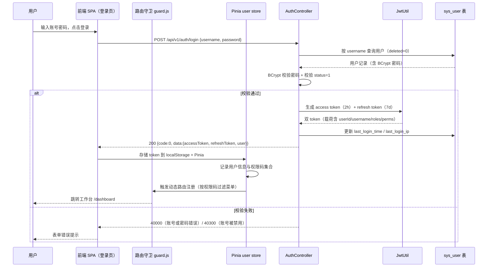
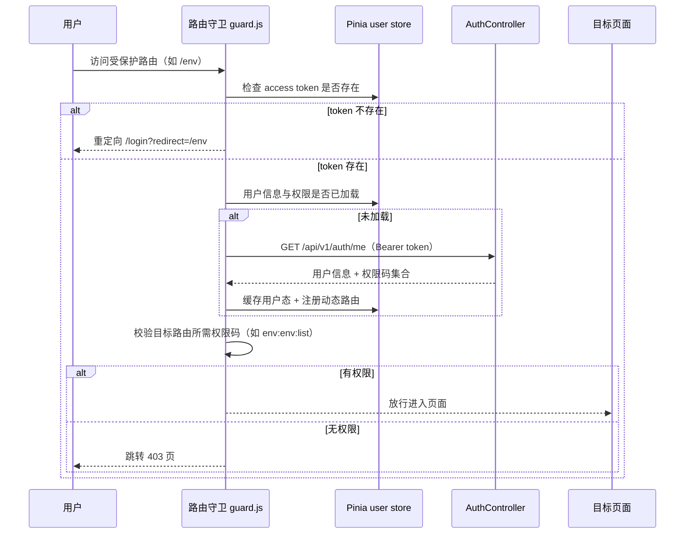
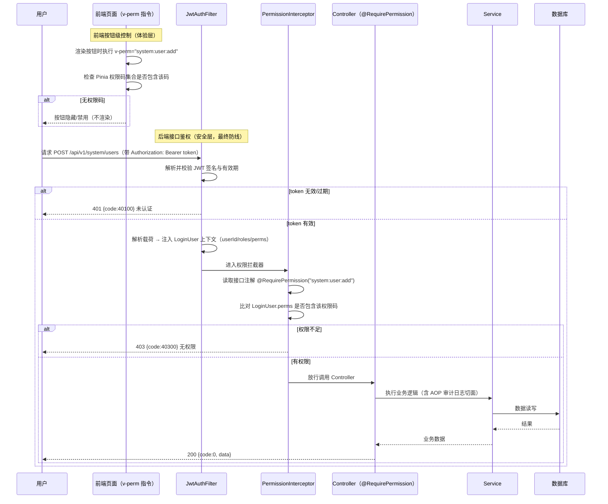
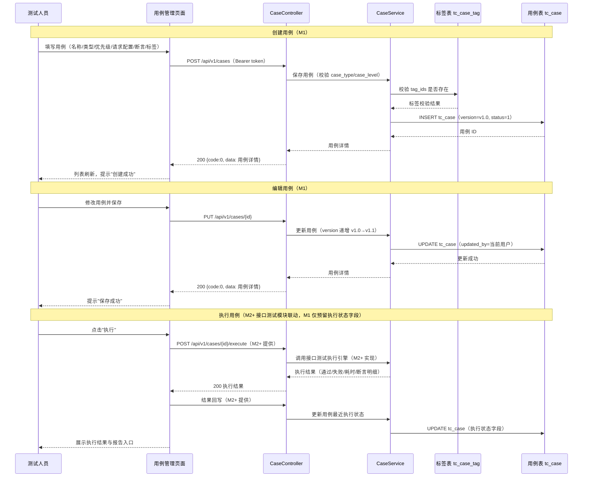
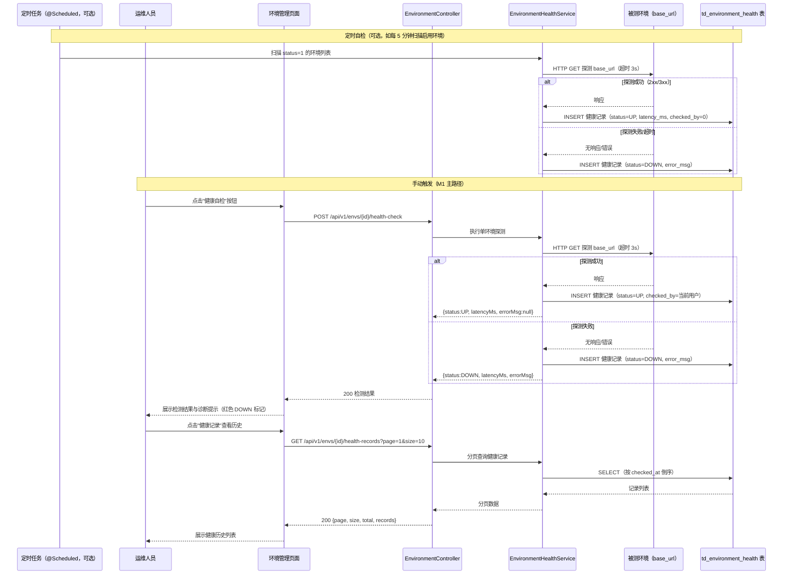
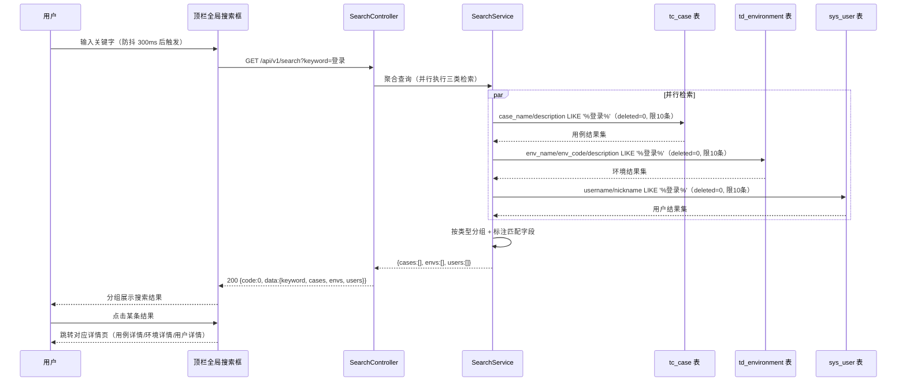

# 核心时序图（M1 基础平台）

| 项目 | 内容 |
|:-----|:-----|
| 文档版本 | v1.0 |
| 编写日期 | 2026-09-21 |
| 文档状态 | 已评审（阶段 1 设计交付物） |
| 适用范围 | M1 基础平台（REQ-001 ~ REQ-008） |
| 关联文档 | `DESIGN_系统架构.md` / `DESIGN_接口设计.md` / `DESIGN_数据模型.md` |

> 本文件覆盖 M1 五条核心业务流程：登录认证、RBAC 权限校验、用例管理、环境健康自检、全局搜索。所有时序图均为 Mermaid `sequenceDiagram`，可直接渲染。

---

## 1. 登录认证（JWT 签发 + 前端存储 + 路由守卫）

> 对应 REQ-002。覆盖：登录接口校验 → 双 token 签发 → 前端存储 → 路由守卫放行。

**路由守卫补充流程**（访问受保护路由时的校验）：

---

## 2. RBAC 权限校验（后端拦截器 + 前端按钮级控制）

> 对应 REQ-003。覆盖：前端 v-perm 按钮级控制 + 后端 JWT 过滤器 + 权限拦截器双重防线。

---

## 3. 用例管理流程（创建 / 编辑 / 执行 / 结果回写）

> 对应 REQ-006。创建与编辑为 M1 落地范围；执行与结果回写由 M2+ 接口测试模块联动实现（M1 仅预留执行状态字段），图中以注释标注扩展位。

---

## 4. 环境健康自检（定时 + 手动触发）

> 对应 REQ-005（ENV-07 数据源健康自检）。M1 实现：手动触发 + 页面加载时自动触发；定时任务（Spring @Scheduled）为 M1 可选增强，图中一并给出。

---

## 5. 全局搜索（跨模块聚合）

> 对应 REQ-008（PRD S-08）。跨用例 / 环境 / 用户三类资源聚合搜索，按类型分组返回。

---

*文档结束*