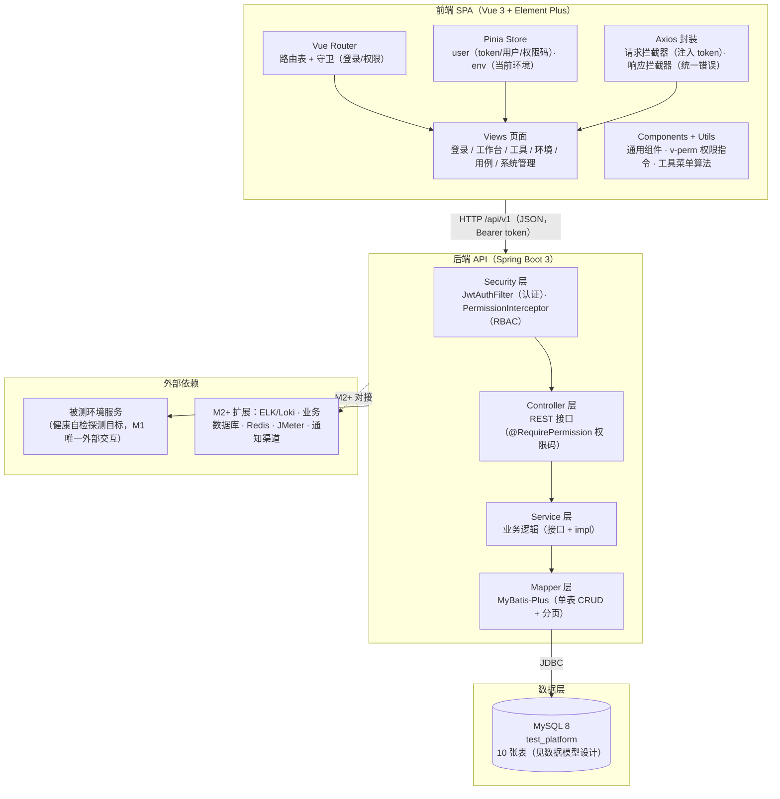
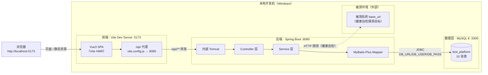

# 系统架构设计（M1 基础平台）

| 项目 | 内容 |
|:-----|:-----|
| 文档版本 | v1.0 |
| 编写日期 | 2026-09-21 |
| 文档状态 | 已评审（阶段 1 设计交付物） |
| 适用范围 | M1 基础平台（REQ-001 ~ REQ-008） |
| 关联文档 | `PRD.md` / `ADR/ADR-001-技术栈选型.md` / `REQ_需求排期表.md` / `DEV_开发进度表.md` |

---

## 1. 设计目标与约束

### 1.1 设计目标

1. 搭建前后端分离的可扩展骨架，M1 八个需求（脚手架 / 登录 JWT / 用户管理+RBAC / 工具菜单 / 环境管理 / 用例管理 / 工作台 / 全局搜索）全部落地。
2. 模块边界清晰，M2-M5（日志 / 数据库 / Redis / 接口测试 / 性能测试 / 报告 / 调度 / 通知 / Mock / 造数 / 缺陷）可在不重构骨架的前提下按模块扩展。
3. 权限模型统一：菜单级 RBAC 贯穿前端路由、前端按钮、后端接口三层。

### 1.2 约束（来自 ADR-001 与 PRD，不可违背）

| 约束 | 内容 |
|:-----|:-----|
| 前端 | Vue 3.4+ / Vite 5+ / Element Plus 2.x / Pinia / Vue Router 4 |
| 后端 | Java 17 / Spring Boot 3.2+ / MyBatis-Plus 3.5.x |
| 数据库 | MySQL 8.0（库名 `test_platform`） |
| 认证 | JWT（jjwt 0.12.x），access token 2h + refresh token 7d |
| 接口风格 | REST + 统一响应体 `{code, message, data}` |
| 默认账号 | `admin / admin123`（BCrypt 存储） |
| 角色 | 管理员(admin) / 测试(test) / 开发(dev) / 运维(ops)，权限范围见 2.4 |
| 环境变量 | `DB_URL` / `DB_USER` / `DB_PASS` / `JWT_SECRET`（见 `环境搭建说明.md`） |

### 1.3 M1 范围（严格对齐 REQ_需求排期表）

| 需求ID | 内容 | 本设计对应章节 |
|:-------|:-----|:---------------|
| REQ-001 | 项目脚手架（前端 / 后端 / MySQL 初始化） | 第 2~5 章 |
| REQ-002 | 登录认证（JWT 签发/校验）+ 登录页 + 路由守卫 | 第 3.2 / 4.2 节 |
| REQ-003 | 用户管理 + 角色权限 RBAC（菜单级） | 第 3.2 / 4.2 节 |
| REQ-004 | 工具菜单（8 个纯前端工具，无后端） | 第 4.2 节 |
| REQ-005 | 环境管理（环境 CRUD + 数据源健康自检） | 第 3.2 / 4.2 节 |
| REQ-006 | 用例管理（用例库 / 标签 / 版本，接口用例为主） | 第 3.2 / 4.2 节 |
| REQ-007 | 工作台（统计卡片 / 近 7 天趋势 / 动态 / 环境状态） | 第 3.2 / 4.2 节 |
| REQ-008 | 全局搜索（跨用例 / 环境 / 用户） | 第 3.2 / 4.2 节 |

---

## 2. 系统分层架构

### 2.1 架构总览



### 2.2 分层职责

| 层 | 职责 | 关键技术点 |
|:---|:-----|:-----------|
| 前端 SPA | 页面渲染、路由控制、状态管理、接口调用、纯前端工具算法 | Vue Router 守卫、Pinia、Axios 拦截器、v-perm 指令 |
| 后端 API | 认证鉴权、业务逻辑、数据访问、审计日志 | Spring Security 过滤链、JWT、MyBatis-Plus、AOP 操作日志 |
| 数据层 | 平台自身元数据持久化 | MySQL 8、InnoDB、utf8mb4、逻辑删除 |
| 外部依赖 | 被测环境服务（健康自检目标）；M2+ 各类数据源/引擎 | M1 仅 HTTP 探测 |

### 2.3 关键设计决策

| 决策 | 说明 |
|:-----|:-----|
| 前后端分离 + Vite 代理 | 开发期前端 5173 将 `/api` 代理到 8080，无跨域问题；生产可 Nginx 同源部署 |
| 无状态 JWT | 服务端不存会话；access token 2h + refresh token 7d，刷新接口换取新 token |
| 三层权限校验 | 前端路由守卫（菜单级）→ 前端 v-perm 指令（按钮级）→ 后端拦截器（接口级，最终防线） |
| 逻辑删除 | 所有业务表带 `deleted` 字段，MyBatis-Plus 全局逻辑删除插件统一过滤 |
| 审计日志 AOP | 后端切面自动记录敏感操作到 `sys_operation_log`，业务代码零侵入 |
| 工具菜单纯前端 | 8 个工具（JSON/加解密/时间戳/正则/URL/随机数据/二维码/扩展）全部浏览器端算法实现，无后端接口 |

### 2.4 角色权限范围（M1 四角色）

| 权限码 | 管理员 admin | 测试 test | 开发 dev | 运维 ops |
|:-------|:------------:|:---------:|:--------:|:--------:|
| `dashboard:view`（工作台） | ✅ | ✅ | ✅ | ✅ |
| `tool:view`（工具菜单） | ✅ | ✅ | ✅ | ✅ |
| `env:env:list`（环境查看） | ✅ | ✅ | ✅ | ✅ |
| `env:env:add/edit/delete`（环境维护） | ✅ | ❌ | ❌ | ✅ |
| `env:env:health`（健康自检） | ✅ | ✅ | ❌ | ✅ |
| `case:case:list`（用例查看） | ✅ | ✅ | ✅ | ✅ |
| `case:case:add/edit/delete`（用例维护） | ✅ | ✅ | ❌ | ❌ |
| `case:tag:list`（标签查看） | ✅ | ✅ | ✅ | ✅ |
| `case:tag:add/delete`（标签维护） | ✅ | ✅ | ❌ | ❌ |
| `system:user:*`（用户管理） | ✅ | ❌ | ❌ | ❌ |
| `system:role:*`（角色权限） | ✅ | ❌ | ❌ | ❌ |
| `system:log:list`（操作日志） | ✅ | ❌ | ❌ | ❌ |
| `search:global`（全局搜索） | ✅ | ✅ | ✅ | ✅ |

> 权限码完整清单见 `DESIGN_接口设计.md` 第 2 章；权限树种子数据见 `DESIGN_数据模型.md` 第 4 章。

---

## 3. 后端模块划分

### 3.1 包结构（`com.testplatform`）

```
backend/src/main/java/com/testplatform
├── TestPlatformApplication.java          # 启动类
├── config/                               # 配置类
│   ├── MybatisPlusConfig.java            # 分页插件 / 逻辑删除 / 字段自动填充
│   ├── CorsConfig.java                   # 跨域配置（开发期）
│   ├── JacksonConfig.java                # Long→String 序列化（防前端精度丢失）
│   └── AsyncConfig.java                  # 异步线程池（健康自检等耗时任务）
├── security/                             # 认证与授权
│   ├── JwtUtil.java                      # JWT 生成/解析（jjwt 0.12.x）
│   ├── JwtAuthFilter.java                # OncePerRequestFilter：解析 token → 注入 LoginUser
│   ├── SecurityConfig.java               # Spring Security 过滤链 / 白名单（/auth/login 等）
│   ├── PermissionInterceptor.java        # RBAC 权限码校验（@RequirePermission）
│   ├── RequirePermission.java            # 权限码注解（标注在 Controller 方法上）
│   └── LoginUser.java                    # 当前登录用户上下文（ThreadLocal）
├── common/                               # 通用
│   ├── Result.java                       # 统一响应体 {code, message, data}
│   ├── PageResult.java                   # 分页响应 {page, size, total, records}
│   ├── ErrorCode.java                    # 错误码枚举（见接口设计文档）
│   ├── BusinessException.java            # 业务异常
│   ├── GlobalExceptionHandler.java       # 全局异常处理（@RestControllerAdvice）
│   ├── BaseEntity.java                   # 公共字段（created_at / updated_at / deleted）
│   └── utils/                            # 通用工具（IP 获取、脱敏等）
├── controller/                           # REST 控制器（薄层，只做参数校验与转发）
│   ├── auth/AuthController.java          # 登录 / 登出 / 刷新 / 当前用户
│   ├── system/UserController.java        # 用户 CRUD + 状态 + 重置密码
│   ├── system/RoleController.java        # 角色 CRUD + 权限分配
│   ├── system/PermissionController.java  # 权限树查询
│   ├── system/OperationLogController.java# 操作日志分页查询
│   ├── env/EnvironmentController.java    # 环境 CRUD + 健康自检 + 健康记录
│   ├── case/CaseController.java          # 用例 CRUD + 状态
│   ├── case/CaseTagController.java       # 用例标签 CRUD
│   ├── dashboard/DashboardController.java# 工作台统计
│   └── search/SearchController.java      # 全局搜索
├── service/                              # 业务逻辑（接口 + impl）
│   ├── auth/AuthService.java             # 登录校验 / token 签发 / 刷新
│   ├── system/UserService.java           # 用户管理（含角色绑定）
│   ├── system/RoleService.java           # 角色管理（含权限绑定）
│   ├── system/PermissionService.java     # 权限树 / 用户权限码集合
│   ├── system/OperationLogService.java   # 审计日志写入与查询
│   ├── env/EnvironmentService.java       # 环境 CRUD
│   ├── env/EnvironmentHealthService.java # 健康自检（HTTP 探测 + 记录）
│   ├── case/CaseService.java             # 用例 CRUD（含标签关联）
│   ├── case/CaseTagService.java          # 标签 CRUD
│   ├── dashboard/DashboardService.java   # 统计卡片 / 趋势 / 环境状态 / 动态
│   └── search/SearchService.java         # 跨模块聚合搜索
├── mapper/                               # MyBatis-Plus Mapper 接口（10 张表一一对应）
│   ├── SysUserMapper.java
│   ├── SysRoleMapper.java
│   ├── SysUserRoleMapper.java
│   ├── SysPermissionMapper.java
│   ├── SysRolePermissionMapper.java
│   ├── SysOperationLogMapper.java
│   ├── TdEnvironmentMapper.java
│   ├── TdEnvironmentHealthMapper.java
│   ├── TcCaseMapper.java
│   └── TcCaseTagMapper.java
├── entity/                               # 实体类（与 10 张表映射，@TableName）
│   ├── SysUser.java / SysRole.java / SysUserRole.java
│   ├── SysPermission.java / SysRolePermission.java / SysOperationLog.java
│   ├── TdEnvironment.java / TdEnvironmentHealth.java
│   └── TcCase.java / TcCaseTag.java
└── dto/                                  # 请求/响应 DTO
    ├── auth/LoginRequest.java / LoginResponse.java / RefreshRequest.java
    ├── system/UserRequest.java / UserResponse.java / RoleRequest.java / AssignPermRequest.java
    ├── env/EnvironmentRequest.java / EnvironmentResponse.java / HealthCheckResponse.java
    ├── case/CaseRequest.java / CaseResponse.java / CaseTagRequest.java
    ├── dashboard/DashboardOverviewVO.java / TrendVO.java / EnvStatusVO.java / ActivityVO.java
    └── search/SearchRequest.java / SearchResultVO.java
```

### 3.2 后端模块职责

| 模块 | 包路径 | 职责 | 对应需求 |
|:-----|:-------|:-----|:---------|
| 认证 auth | `controller/auth` `service/auth` | 登录校验、JWT 签发/刷新、当前用户信息 | REQ-002 |
| 系统管理 system | `controller/system` `service/system` | 用户 CRUD、角色 CRUD、权限分配、权限树、操作日志 | REQ-003 |
| 环境管理 env | `controller/env` `service/env` | 环境 CRUD、健康自检（HTTP 探测）、健康记录 | REQ-005 |
| 用例管理 case | `controller/case` `service/case` | 用例 CRUD、标签 CRUD、用例-标签关联 | REQ-006 |
| 工作台 dashboard | `controller/dashboard` `service/dashboard` | 统计卡片、近 7 天趋势、环境状态、最近动态 | REQ-007 |
| 全局搜索 search | `controller/search` `service/search` | 跨用例/环境/用户聚合搜索 | REQ-008 |
| 工具菜单 tool | 无后端（纯前端） | 8 个工具全部浏览器端实现 | REQ-004 |

### 3.3 模块间依赖规则

1. `controller → service → mapper`，禁止 controller 直接操作 mapper。
2. `security` 与 `common` 为横切层，所有模块可依赖；`entity` 仅被 `mapper`/`service` 使用，不直接暴露给 controller（controller 层用 DTO 出入参）。
3. 模块间不互相调用 service（M1 规模小，跨模块数据通过 mapper 直查或聚合查询实现，如工作台统计直接查各表 mapper）。
4. 新增模块（M2+）只需新增 `controller/xxx` + `service/xxx` + `mapper/XxxMapper.java` + `entity/Xxx.java` 四件套，不改动既有模块。

---

## 4. 前端模块划分

### 4.1 目录结构

```
frontend/src
├── main.js                        # 入口（挂载 App / Pinia / Router / Element Plus）
├── App.vue                        # 根组件
├── layout/                        # 主布局
│   ├── MainLayout.vue             # 侧边菜单 + 顶栏（环境切换器 + 用户下拉）
│   └── components/
│       ├── SideMenu.vue           # 动态菜单（按权限码过滤）
│       ├── NavBar.vue             # 顶栏
│       ├── EnvSwitcher.vue        # 全局环境切换器（REQ-005 ENV-04）
│       └── UserDropdown.vue       # 用户区（头像 / 退出登录）
├── router/
│   ├── index.js                   # 路由表（静态路由 + 动态路由注册）
│   └── guard.js                   # 路由守卫（登录校验 + 权限校验 + 403/404）
├── store/
│   ├── user.js                    # 用户态：token / 用户信息 / 权限码集合 / 动态路由
│   └── env.js                     # 当前环境（全局切换，联动各模块）
├── api/
│   ├── request.js                 # axios 实例（注入 token / 统一错误处理 / 401 跳登录）
│   ├── auth.js                    # 登录 / 登出 / 刷新 / 当前用户
│   ├── user.js                    # 用户管理
│   ├── role.js                    # 角色与权限
│   ├── log.js                     # 操作日志
│   ├── env.js                     # 环境管理 + 健康自检
│   ├── case.js                    # 用例管理 + 标签
│   ├── dashboard.js               # 工作台
│   └── search.js                  # 全局搜索
├── utils/
│   ├── auth.js                    # token 存取（localStorage：accessToken / refreshToken）
│   ├── permission.js              # v-perm 指令注册 + hasPerm 判断
│   └── tools/                     # 工具菜单算法（纯前端，无后端）
│       ├── jsonTool.js            # JSON 格式化 / 压缩 / 校验 / 对比
│       ├── cryptoTool.js          # MD5 / SHA / Base64 / AES / RSA
│       ├── timestampTool.js       # 时间戳与日期互转
│       ├── regexTool.js           # 正则测试（实时高亮）
│       ├── urlTool.js             # URL 编解码 / Query 解析
│       ├── randomTool.js          # 随机数据生成（身份证/手机号/UUID 等）
│       ├── qrcodeTool.js          # 二维码生成 / 解析
│       └── index.js               # 工具注册表（可插拔，新增工具只需注册一项）
├── components/                    # 通用组件
│   ├── Pagination.vue             # 分页（page/size/total）
│   ├── StatusTag.vue              # 状态标签（启用/禁用/UP/DOWN）
│   ├── SearchBar.vue              # 列表筛选栏
│   └── TagSelect.vue              # 标签多选
└── views/
    ├── login/Login.vue            # 登录页（REQ-002）
    ├── dashboard/Dashboard.vue    # 工作台（REQ-007）
    ├── tool/                      # 工具菜单（REQ-004，8 工具）
    │   ├── ToolIndex.vue          # 工具入口页（按注册表渲染）
    │   ├── JsonTool.vue / CryptoTool.vue / TimestampTool.vue
    │   ├── RegexTool.vue / UrlTool.vue / RandomTool.vue / QrcodeTool.vue
    ├── env/                       # 环境管理（REQ-005）
    │   ├── EnvironmentList.vue    # 环境列表 + 健康状态列
    │   ├── EnvironmentForm.vue    # 环境新建/编辑
    │   └── HealthRecords.vue      # 健康检查记录抽屉
    ├── case/                      # 用例管理（REQ-006）
    │   ├── CaseList.vue           # 用例列表（类型/标签/关键字筛选）
    │   ├── CaseForm.vue           # 用例新建/编辑（请求配置 + 断言）
    │   └── CaseDetail.vue         # 用例详情
    ├── system/                    # 系统管理（REQ-003）
    │   ├── UserList.vue           # 用户管理（CRUD + 角色分配 + 重置密码）
    │   ├── RoleList.vue           # 角色管理（CRUD + 权限树勾选）
    │   └── OperationLog.vue       # 操作日志
    └── error/403.vue / 404.vue    # 错误页
```

### 4.2 前端模块职责

| 模块 | 目录 | 职责 | 对应需求 |
|:-----|:-----|:-----|:---------|
| 登录 | `views/login` `store/user` | 登录表单、token 存储、路由守卫 | REQ-002 |
| 主布局 | `layout` | 侧边菜单（按权限过滤）、顶栏、环境切换器 | REQ-003 / REQ-005 |
| 工作台 | `views/dashboard` | 统计卡片、趋势图、环境状态、动态列表 | REQ-007 |
| 工具菜单 | `views/tool` `utils/tools` | 8 个纯前端工具 + 可插拔注册表 | REQ-004 |
| 环境管理 | `views/env` | 环境 CRUD、健康自检按钮、健康记录 | REQ-005 |
| 用例管理 | `views/case` | 用例 CRUD、标签管理、类型/标签筛选 | REQ-006 |
| 系统管理 | `views/system` | 用户/角色/权限/日志 | REQ-003 |
| 全局搜索 | 顶栏搜索框 + `api/search` | 跨模块聚合搜索、结果分组跳转 | REQ-008 |

### 4.3 前端关键机制

1. **路由守卫（`router/guard.js`）**：无 token → 跳登录页；有 token 但未加载用户信息 → 调 `GET /api/v1/auth/me` 拉取用户与权限码 → 按权限码过滤动态路由 → 校验目标路由权限，无权限跳 403。
2. **按钮级权限（`utils/permission.js`）**：注册 `v-perm="system:user:add"` 指令，无对应权限码时移除按钮 DOM。
3. **Axios 拦截器（`api/request.js`）**：请求拦截注入 `Authorization: Bearer <accessToken>`；响应拦截统一处理 `{code,message,data}`，401 时尝试 refresh token 后重放请求，刷新失败跳登录页。
4. **工具菜单可插拔（`utils/tools/index.js`）**：工具以「名称 + 组件 + 图标」注册进数组，菜单页遍历渲染；新增工具 = 新增一个组件 + 注册一项，零改动其他代码。

---

## 5. 部署形态

### 5.1 本地开发部署图



### 5.2 端口与代理约定

| 项 | 值 | 说明 |
|:---|:---|:-----|
| 前端开发端口 | 5173 | Vite dev server，`vite.config.js` 配置 `server.port=5173` |
| 后端端口 | 8080 | Spring Boot 内嵌 Tomcat，`server.port=8080` |
| 代理规则 | `/api` → `http://localhost:8080` | Vite `server.proxy`，后端接口统一前缀 `/api/v1` |
| 数据库端口 | 3306 | MySQL 8，连接串由 `DB_URL` 环境变量注入 |
| 健康检查 | `GET http://localhost:8080/api/health` | 后端存活探针（环境搭建说明约定） |

### 5.3 环境变量（来自 `环境搭建说明.md`）

| 变量 | 用途 | 默认值（仅本地） |
|:-----|:-----|:-----------------|
| `DB_URL` | MySQL 连接串 | `jdbc:mysql://localhost:3306/test_platform?useSSL=false&serverTimezone=Asia/Shanghai&characterEncoding=utf8` |
| `DB_USER` | 数据库账号 | `root` |
| `DB_PASS` | 数据库密码 | 本地配置 |
| `JWT_SECRET` | JWT 签名密钥（≥32 字符） | 开发默认值，生产必须环境变量注入 |

---

## 6. M1 与后续阶段的模块扩展位

### 6.1 后端扩展位（M2+ 新增模块，不动既有骨架）

| 阶段 | 新增模块 | 扩展方式 |
|:-----|:---------|:---------|
| M2 | 日志查询 / 数据库查询 / Redis 查询 / 文件管理 | 新增 `controller/query`、`service/query`、`mapper`、`entity` 四件套；数据源连接配置复用 `td_environment` 扩展 |
| M3 | 接口测试 / Mock / 缺陷 / 报告中心 / 日报版本 | 新增 `controller/api-test` 等；用例执行引擎复用 `tc_case`（执行状态字段预留） |
| M4 | 性能测试 / 数据工厂 / 通知中心 | 新增 `controller/perf` 等；通知渠道独立模块 |
| M5 | 任务调度 / CI 集成 / 审批流 / 多项目空间 | 新增 `controller/schedule` 等；RBAC 扩展项目维度（ADR-001 预留 ADR-002） |

### 6.2 前端扩展位（M2+ 新增页面，不动既有骨架）

| 阶段 | 新增页面 | 扩展方式 |
|:-----|:---------|:---------|
| M2 | 日志检索 / SQL 编辑器 / Redis 浏览 / 文件管理 | 新增 `views/query/*`，路由动态注册，菜单权限树加节点 |
| M3 | 接口测试工作台 / Mock 配置 / 报告中心 | 新增 `views/api-test/*` 等 |
| M4 | 压测场景 / 造数模板 / 通知渠道 | 新增 `views/perf/*` 等 |
| M5 | 调度任务 / CI 配置 / 审批中心 | 新增 `views/schedule/*` 等 |

### 6.3 数据层扩展位

M2+ 按模块新增表（如 `td_datasource`、`td_log_source`、`api_collection`、`api_case`、`perf_scenario`、`test_report`、`schedule_task`、`notify_channel`、`mock_api`、`data_factory_template`、`bug_config` 等），沿用本设计第 2 章的 DDL 规范（InnoDB / utf8mb4 / bigint 主键 / 逻辑删除 / uk_/idx_ 索引前缀），不修改既有 10 张表结构。

---

*文档结束*